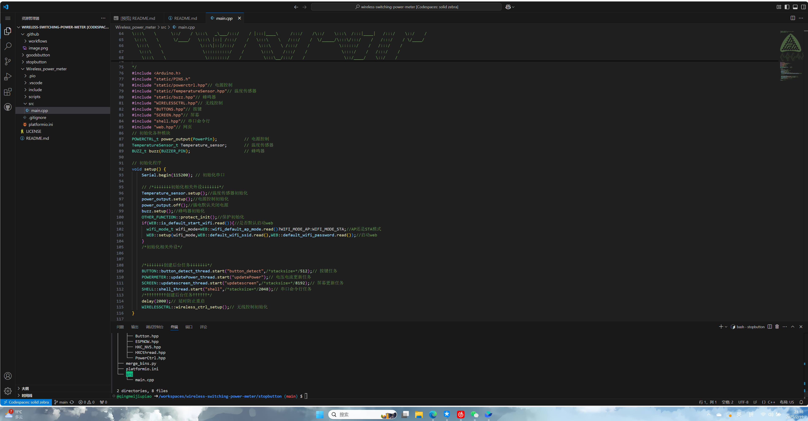
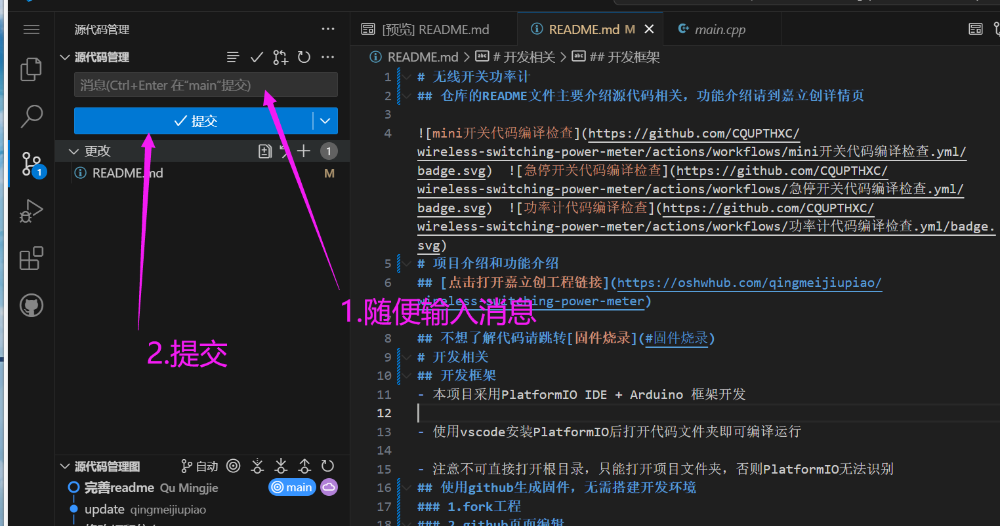
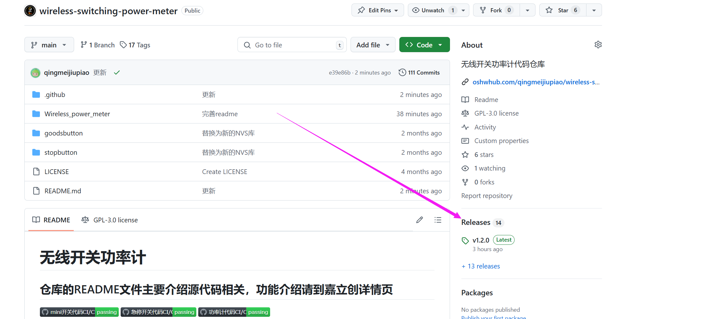

# 无线开关功率计
## 仓库的README文件主要介绍源代码相关，功能介绍请到[嘉立创详情页](https://oshwhub.com/qingmeijiupiao/wireless-switching-power-meter)

    
# 项目介绍和功能介绍
## [点击打开嘉立创工程链接](https://oshwhub.com/qingmeijiupiao/wireless-switching-power-meter)

## 不想了解代码请跳转[固件烧录](#固件烧录)
# 开发相关
## 开发框架
- 本项目采用PlatformIO IDE + Arduino 框架开发

- 使用vscode安装PlatformIO后打开代码文件夹即可编译运行

- 注意不可直接打开根目录，只能打开项目文件夹，否则PlatformIO无法识别

- 本工程提供[使用github生成固件，无需搭建开发环境的教程](#使用github生成固件，无需搭建开发环境)
# 工程介绍
## 功率计本体
功率计本体代码，pro版本和普通版均为此工程

默认编译会生成两种固件，pro版本和普通版，可以自行选择

### 文件树和备注
```
Wireless_power_meter
├── include //模块文件，主要的代码均在这里
│   ├── BUTTONS.hpp //按键封装驱动
│   ├── OTHER_FUNCTION.hpp //其他功能，例如：各种保护实现
│   ├── SCREEN.hpp //屏幕显示相关代码
│   ├── WIRELESSCTRL.hpp //无线控制相关代码
│   ├── img //储存图片数组的文件夹
│   │   ├── CQUPTHXC_img.hpp
│   │   ├── JLC_LOGO.hpp
│   │   ├── robocon_img.hpp
│   │   └── wifi_img.hpp
│   ├── shell.hpp //串口控制台相关实现
│   ├── static //底层驱动，不建议修改下面的文件
│   │   ├── ESPNOW.hpp //ESPNOW封装库
│   │   ├── FixedSizeQueue.hpp //定长队列封装库
│   │   ├── HXC_NVS.hpp //NVS存储封装库，用于断电数据保存
│   │   ├── HXCthread.hpp //对FreeRTOS的二次封装库，实现类似std::thread的功能
│   │   ├── PINS.h //按键宏定义
│   │   ├── POWERMETER.hpp //电流电压数据读取的封装，PRO版本和普通版本代码唯一的区别在这个文件，由宏定义控制
│   │   ├── SimpleSerialShell.hpp //串口控制台底层驱动
│   │   ├── TemperatureSensor.hpp //温度读取驱动
│   │   ├── buzz.hpp //蜂鸣器驱动
│   │   └── powerctrl.hpp //输出控制驱动
│   ├── web //网页前端相关
│   │   ├── c_header //网页前端数组，由脚本自动生成不可自行修改
│   │   │   └── index_html.h
│   │   └── src //网页前端源文件
│   │       └── index.html
│   └── web.hpp //网页后端和WIFI驱动
├── platformio.ini //工程配置文件
├── scripts //工程脚本
│   ├── embed_files.py //前端数组生成脚本
│   └── merge_bins.py //固件生成脚本
└── src
    └── main.cpp //主函数
```

#### **注意**

PIO默认上传是PRO版本，如果想要普通版，需要在platformio.ini中注释另外一个版本的环境配置

如下为注释PRO版本的环境,此时仅编译上传普通版本固件
```
;;PRO版本
;[env:Wireless_power_meter_pro]
;extends = common
;build_flags = ${common.build_flags} -D IS_PRO_VERSION=1
;lib_deps = 
;	${common.lib_deps}
;	adafruit/Adafruit INA228 Library@^1.1.0

;普通版本
[env:Wireless_power_meter]
extends = common
build_flags = ${common.build_flags}
lib_deps = 
	${common.lib_deps}
	robtillaart/INA226@^0.5.3

```
根据提供的代码，我将补全功率计本体的命令说明部分：

### 串口控制台

目前v1.2.4版本功率计本体和mini开关可用  
**注意**  
- 字符编码为UTF-8  
- 换行为"\r\n"即CRLF  
- 由于是虚拟串口，波特率可以为任意值  
[点击打开在线串口助手](https://serial.keysking.com/)  
使用时点左下角软件设置，设置换行为CRLF  

#### 功率计本体命令说明

1. **系统信息**
   - `info` - 显示编译信息
     - 返回：版本类型(Pro/Normal)和编译日期

2. **采样电阻配置**
   - `set_resistance [阻值mΩ]` - 设置采样电阻值
     - 参数：电阻值(单位mΩ，范围0-10)
     - 示例：`set_resistance 2.5`
   - `get_resistance` - 获取当前采样电阻值
     - 返回：当前设置的采样电阻值(mΩ)

3. **ESP-NOW无线配置**
   - `set_esp_now_secret_key [密钥]` - 设置ESP-NOW通信密钥
     - 参数：16进制密钥(0x0000-0xFFFF)
     - 示例：`set_esp_now_secret_key 0xA5A5`
     - 注意：此密钥需与配对设备保持一致
   - `get_esp_now_secret_key` - 获取当前ESP-NOW密钥
     - 返回：当前16进制密钥

4. **保护功能配置**
   - `get_protect_state` - 获取所有保护状态
     - 返回：电流/电压/高温保护开关状态
   - `set_voltage_protect [开关] [电压值V]` - 设置电压保护
     - 参数：开关(0/1)，保护电压值(单位V)
     - 示例：`set_voltage_protect 1 3.2`
   - `set_current_protect [开关] [电流值A]` - 设置电流保护
     - 参数：开关(0/1)，保护电流值(单位A，最大300)
     - 示例：`set_current_protect 1 5.0`
   - `set_high_temperature_protect [开关] [温度值℃]` - 设置高温保护
     - 参数：开关(0/1)，保护温度值(单位℃，最大150)
     - 示例：`set_high_temperature_protect 1 80`

5. **数据打印控制**
   - `printDATA [开关]` - 控制电压/电流/功率数据打印
     - 参数：开关(0/1)
     - 示例：`printDATA 1`

6. **WiFi网络配置**
   - `wifi [开关] [AP模式] [SSID] [密码]` - 配置WiFi参数
     - 参数：
       - 开关(0/1)
       - AP模式(0:STA,1:AP)
       - SSID(字符串)
       - 密码("null"表示无密码)
     - 示例：`wifi 1 0 MyWiFi mypassword`
     - 注意：设置后会立即重启生效
   - `get_ip` - 获取当前IP地址
     - 返回：当前网络模式(AP/STA)和IP地址
     - 
#### 小开关命令说明

1. **配对功能**
   - `pair` - 发送配对请求并显示已配对设备列表
     - 返回：已配对设备的MAC地址列表
     - 示例：`pair`
     - 注意：配对请求发送后会显示当前所有已配对设备

2. **电源控制**
   - `ctrl [开关状态]` - 远程控制功率计输出状态
     - 参数：开关状态(0:关闭，1:开启)
     - 示例：`ctrl 1` (开启功率计输出状态)
     - 注意：此命令会立即改变功率计输出状态

3. **数据打印控制**
   - `printDATA [开关状态]` - 控制电压/电流数据打印
     - 参数：开关状态(0:关闭，1:开启)
     - 示例：`printDATA 1` (开启数据打印)
     - 返回：开启后会持续打印电压,电流数据(格式:电压值,电流值)
     - 注意：数据打印间隔为10ms

4. **远程打印功能**
   - `remoteprint [开关状态]` - 控制远程打印功能
     - 参数：开关状态(0:关闭，1:开启)
     - 示例：`remoteprint 1` (开启远程打印)
     - 返回：开启后会显示当前ESP-NOW密钥和设备MAC地址
     - 功能说明：
       - 开启后可通过ESP-NOW接收其他设备的打印数据
       - [需要其他设备配合remotePrint库使用](https://github.com/CQUPTHXC/wireless-switching-power-meter/tree/main/goodsbutton/lib/remotePrint)
       - 密钥和设备MAC地址用于其他设备配置

5. **ESP-NOW配置**
   - `set_esp_now_secret_key [密钥]` - 设置ESP-NOW通信密钥
     - 参数：16进制密钥(0x0000-0xFFFF)
     - 示例：`set_esp_now_secret_key 0xA5A5`
     - 注意：此密钥需与配对设备保持一致
   - `get_esp_now_secret_key` - 获取当前ESP-NOW密钥
     - 返回：当前16进制密钥

**使用提示**：
1. 配对前请确保所有设备使用相同的ESP-NOW密钥
2. 所有命令在参数错误时会返回"参数错误"提示，并返回-1状态码。  
3. WiFi配置成功后设备会自动重启。

### 后端API 文档

#### 1. 获取功率数据

**URL:** `/data`

**Method:** `GET`

**Description:**  
该 API 用于获取当前的功率数据，包括电压、电流、累计功耗、输出状态以及当前时间。

**Response:**

- **Status Code:** `200 OK`
- **Content-Type:** `application/json`

**Response Body:**

```json
{
  "voltage": float,       // 电压值
  "current": float,       // 电流值
  "mah": float,           // 累计功耗（毫安时）
  "state": bool,          // 输出状态（true 或 false）
  "time": unsigned long   // 当前时间（毫秒）
}
```

**Example Response:**

```json
{
  "voltage": 12.3,
  "current": 1.5,
  "mah": 4500.0,
  "state": true,
  "time": 123456
}
```

---

#### 2. 控制输出状态

**URL:** `/ctrl`

**Method:** `POST`

**Description:**  
该 API 用于控制电源输出的开关状态。通过发送 JSON 格式的请求体来设置输出状态。

**Request Body:**

```json
{
  "state": bool  // 输出状态（true 表示关闭，false 表示开启）
}
```

**Response:**

- **Status Code:** `200 OK` (成功)
- **Status Code:** `400 Bad Request` (JSON 解析失败)
- **Content-Type:** `text/plain`

**Response Body:**

- 成功时返回：`"OK"`
- 失败时返回：`"JSON 解析失败"`

**Example Request:**

```json
{
  "state": true
}
```

**Example Response:**

```
OK
```

---

#### 错误处理

- **400 Bad Request:** 如果请求体中的 JSON 数据无法解析，服务器将返回 `400 Bad Request` 状态码，并附带错误信息 `"JSON 解析失败"`。

---

#### 注意事项

1. **时间戳:** `/data` API 返回的时间戳是自设备启动以来的毫秒数（`millis()`）。
2. **输出状态:** `/ctrl` API 中的 `state` 字段为 `true` 时表示关闭输出，为 `false` 时表示开启输出。
3. **JSON 格式:** 请确保发送的 JSON 数据格式正确，否则会导致解析失败。

---

#### 示例代码

##### 获取功率数据 (GET /data)

```bash
curl -X GET http://<server-ip>/data
```

##### 控制输出状态 (POST /ctrl)

```bash
curl -X POST http://<server-ip>/ctrl -d '{"state": true}' -H "Content-Type: application/json"
```

- ```<server-ip>```:功率计的ip地址，可通过串口控制台```get_ip```命令获取
---

### 文件修改指南
#### 修改页面
在```./include/SCREEN.hpp```文件中修改页面,以及修改页面顺序，添加页面
#### 控制台命令
在```./include/shell.hpp```文件中修改控制台命令
#### web
在```./include/web/src/index.html```文件中修改web前端
在```./include/web.hpp```文件中修改web后端
#### 保护功能 
在```./include/OTHER_FUNCTION.hpp```文件中修改电压/电流/温度保护源码
#### 无线控制 
在```./include/WIRELESSCTRL.hpp```文件中修改无线控制
#### 曲线记录时间
在```./include/static/POWERMETER.hpp```文件中修改数据曲线记录时间
## mini开关代码
文件树和备注如下
```
goodsbutton
├── include
│   ├── ESPNOW.hpp //ESPNOW封装库
│   ├── HXC_NVS.hpp //NVS存储封装库，用于断电数据保存
│   ├── PowerCtrl.hpp //功率计输出控制封装
│   └── README
├── merge_bins.py //固件生成脚本
├── platformio.ini //工程配置文件
└── src
    └── main.cpp //主函数
```
## 急停开关代码
文件树和备注如下
```
stopbutton
├── include
│   ├── Button.hpp
│   ├── ESPNOW.hpp //ESPNOW封装库
│   ├── HXC_NVS.hpp //NVS存储封装库，用于断电数据保存
│   ├── HXCthread.hpp //对FreeRTOS的二次封装库，实现类似std::thread的功能
│   └── PowerCtrl.hpp //功率计输出控制封装
├── merge_bins.py //固件生成脚本
├── platformio.ini //工程配置文件
└── src
    └── main.cpp //主函数
```
## 二次开发封装库
如下文件可集成到任意型号的ESP32 arduino框架工程中

- ```ESPNOW.hpp```
- ```PowerCtrl.hpp```
文件目录：./goodsbutton/include/

示例：
```
#include <Arduino.h>
#include "PowerCtrl.hpp"

void setup(){
    //初始化串口
    Serial.begin(115200);

    //初始化
    PowerCtrl::setup();

    //主动配对
    //PowerCtrl::send_pair_package();

    //让功率计以50HZ的频率回传数据
    //PowerCtrl::ctrl_send_data(true,50);
}

void loop(){
    PowerCtrl::power_on();//开启功率计输出
    delay(1000);
    PowerCtrl::power_off();//关闭功率计输出
    delay(1000);
    
    //打印回传的数据，需要先开启数据回传并且是配对的设备
    //Serial.print(PowerCtrl::power_data.voltage);
    //Serial.print(",");
    //Serial.println(PowerCtrl::power_data.current);
}
```


# 使用github生成固件，无需搭建开发环境
## 1.fork工程

## 2.github页面编辑 

**在自己fork的工程页面下，按下键盘的```,```按键进入在线编辑**



## 3.修改代码，提交更改
此时与用电脑的vscode打开工程文件无区别

当修改完成代码后提交git保存


## 4.创建标签编译

本工程使用github action实现CI/CD流程

该工程的配置为当有新的版本```tag```时

**并且标签推送到仓库**即可生成固件到仓库的release

### 使用在线vscode创建本地标签


### 使用命令行推送标签
创建本地标签后点击命令行输入
```git push --tag```

回车后过几分钟固件即可自动上传到release处


## 5.按照[固件烧录](#固件烧录)处教程烧录固件

# 固件烧录
如果不想搭建开发环境也可以选择直接烧录固件
## [点击打开在线烧录固件网页](https://espressif.github.io/esp-launchpad/?flashConfigURL=https://raw.githubusercontent.com/CQUPTHXC/wireless-switching-power-meter/main/.github/config.toml)
### 快速烧录
该超链接中可以直接烧录编译好的固件


## 使用自己的固件烧录
### 点击DIY

### 准备固件
### 选择固件文件

### 选择烧录端口(带jtag标识)

### 点击program


